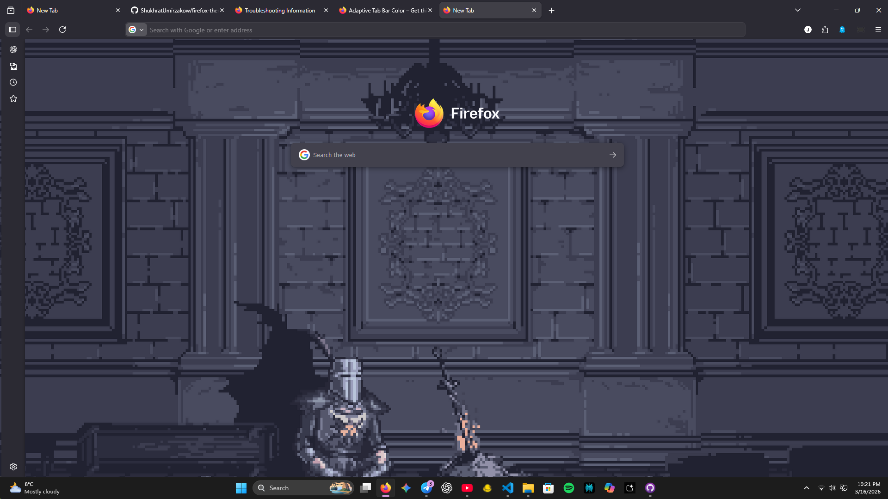

🌑 Minimalist Firefox Theme
This theme is designed for a clean, distraction-free browsing experience. It achieves a "True Minimalist" look by removing UI clutter, including the background settings buttons.

# 🔧 Firefox Minimalist Theme Installation Guide

A step-by-step guide to customize Firefox with a clean, minimalist look.  
⚠️ Note: This theme hides the "Edit" buttons on the New Tab page, so set your wallpaper first!

---

## 📌 Step 1: Set the Wallpaper
1. Open a **New Tab** in Firefox.
2. Click the **Settings (Gear icon)** in the top-right corner (or "Personalize").
3. Upload the included `wallpaper.png`.
4. ✅ Verify that the wallpaper looks correct before continuing.

---

## 📌 Step 2: Enable Custom Styles
Firefox needs permission to load custom code.

1. Type `about:config` in the address bar.
2. Click **Accept the Risk and Continue**.
3. Search for:
   
   toolkit.legacyUserProfileCustomizations.stylesheets

5. Toggle it to **true**.

---

## 📌 Step 3: Install `userContent.css`
This file applies the minimalist look.

1. Type `about:support` in the address bar.
2. Find **Profile Folder** → click **Open Folder**.
3. Check for a folder named `chrome`.  
- If missing, create one manually.
4. Copy `userContent.css` into the `chrome` folder.

---

## 📌 Step 4: Install Required Extensions
For full functionality:

1. Open the included `links.txt`.
2. Copy each URL into Firefox.
3. Install the listed add-ons (dark mode, custom tab behavior, etc.).

---

## 📌 Step 5: Restart Firefox
1. Close all Firefox windows.
2. Relaunch Firefox.
3. 🎉 Enjoy your clean, minimalist setup!

---

### 🔄 Changing Wallpaper Later
To change your wallpaper:
- Temporarily remove `userContent.css` from the `chrome` folder.
- Restart Firefox → change wallpaper → reapply `userContent.css`.

---

## ✅ Final Notes
- Keep backups of your `userContent.css` file.
- Extensions may need updates over time.
- This setup is designed for **simplicity and focus**.
